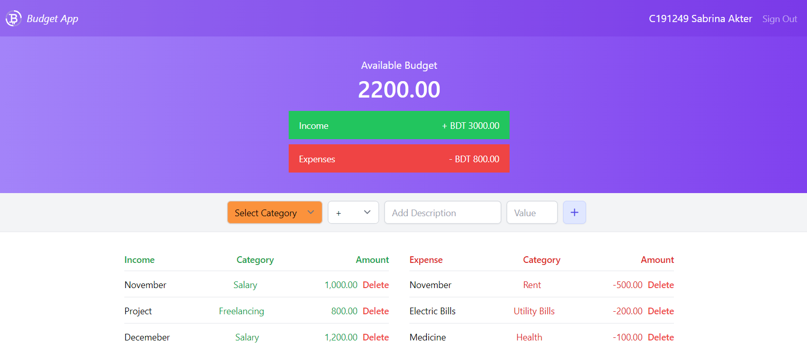
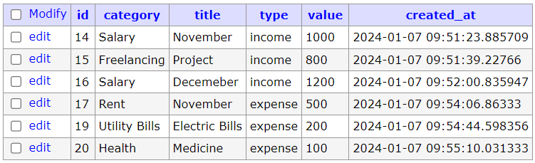

## Final Assignment by C191249 Sabrina Akter

## Tasks have been completed

### Front-end:
1. Add Category dropdown option in Transaction Entry row
2. Add Category Column in Income/Expense List
     

### Back-end:
3. Use API endpoints to fetch data and store data
4. API should use the database to store all visible data on the page

